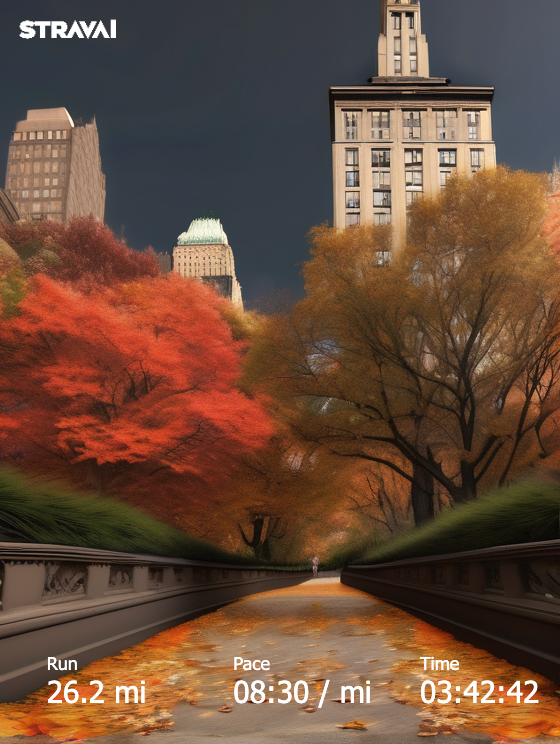

## What is this?



This is a webapp which generates parody screenshots from the popular running app [Strava](https://www.strava.com/) using:
 - [Stable Diffusion](https://replicate.com/stability-ai/stable-diffusion)
 - via [Replicate](https://replicate.com/)
 - with [Next.js](https://nextjs.org/).

 You can test it out here: https://stravai-run-generator.vercel.app/

## Running the code

First, run the development server:

```bash
npm run dev
```

Open [http://localhost:3000](http://localhost:3000) with your browser to see the result.
